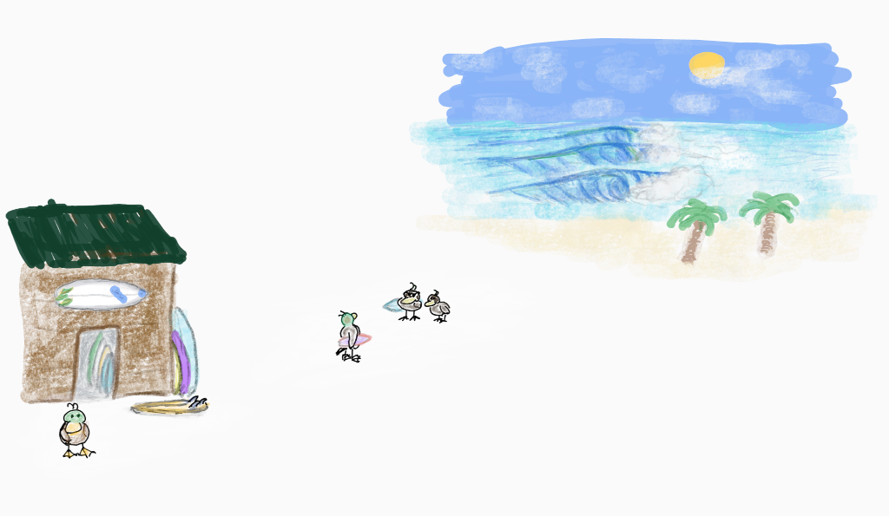
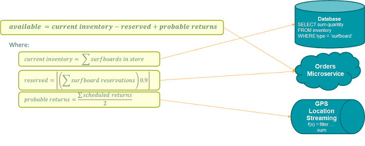
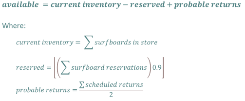
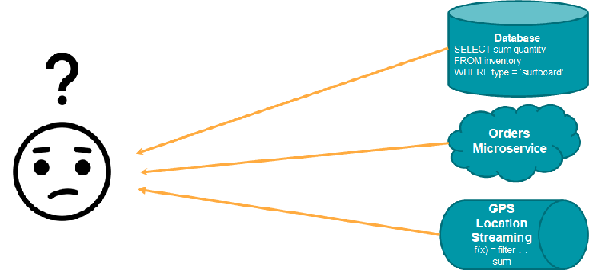
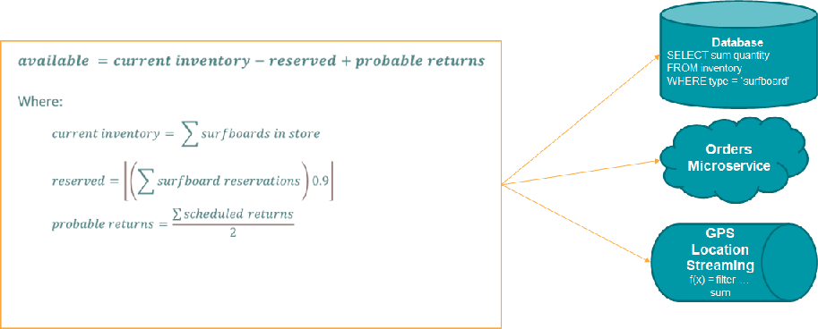

# Morphir Tutorial

## What?
Morphir is a project to share business logic across people and technologies.  By establishing a commong data structure for storing business logic, Morphir enables an ecosystem of tools to define and process business logic in useful ways.  Before we get into the tutorial, it's worth considering what we mean by business logic.  Take the essence of any business application, take away all of the infrastructure, concurrency, messaging, etc.  What's left is the essense of the application - it's reason for being.  That is the business logic.  It is how the business experts would describe the application in the language of the business.  

For this tutorial, we'll use the example of a surfboard rental business.

The business is simple: Rent surfboards whenever they're available.

## Why?
Seems simple enough, so why would we consider doing it with Morphir.  One of our goals is to optimize the feedback loop between the business and developers. 
Business experts tend to the think of an application in its business terms.  

### Business View

In this case they might be thinking something like:

  <math xmlns="http://www.w3.org/1998/Math/MathML" mode="display">
     <mrow>
          <mi>availability</mi>
          <mo>=</mo>
          <mi>inventory</mi>
          <mn>+</mn>
          <mi>returns</mi>
          <mn>-</mn>
          <mi>reservations</mi>
     </mrow>
  </math>
   
   
where:
   
  

  <math xmlns="http://www.w3.org/1998/Math/MathML" mode="display">
     <mrow>
          <mi>inventory</mi>
          <mo>=</mo>
          <mo>&sum;</mo> <mi>items in the store</mi>
     </mrow>
      
     <mrow>
          <mi>returns</mi>
          <mo>=</mo>
          <mo>&lfloor;</mo>
          <mfrac>
               <mo>( </mo><mo>&sum;</mo> <mi>scheduled returns</mi><mo> )</mo>
               <mo>*</mn>
               <mn>late return ratio</mn>
          </mfrac>
          <mo>&rfloor;</mo>
     </mrow>
      
     <mrow>
          <mi>reserved</mi>
          <mo>=</mo>
          <mo>&lfloor;</mo>
          <mrow>
               <mo>( </mo><mo>&sum;</mo><mi>current reservations</mi><mo> )</mo>
               <mo>*</mn>
               <mn>no show ratio</mn>
          </mrow>
          <mo>&rfloor;</mo>
     </mrow>
  </math>
  

### Developer View

This specification gets handed to developers, who immediately start thinking of how to split it up to run most efficiently on the various technologies. They might view it as:

<!--  -->

## Lost Knowledge
The problem comes when the business specifications get stale or lost over time.  What's left is this:

That's a major problem for a large application.  It leads to legacy debt, higher risk, and slower delivery.

## Optimum Efficiency
We want to get back to a continuous state of:

So with that out of the way, let's dive in...
* [Install Morphir with a new project](install.md)
* [Step 1: First Logic Model](step_1_first_logic/readme.md)

[Next](install.md)

